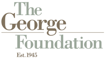

The George Foundation is proud to serve as the founding catalyst of Fort Bend LINC—an innovative, community-driven initiative designed to streamline access to rental, mortgage, and utility assistance for residents across Fort Bend County. Recognizing housing stability as a cornerstone of economic resilience, the Foundation launched this effort in partnership with Connective and a coalition of nonprofit, faith-based, and public sector organizations.

Using a human-centered design process, The George Foundation led early efforts to identify gaps in the existing support system, elevate the voices of those most impacted, and co-create a coordinated, client-focused solution. These efforts have resulted in the development of a new housing stability blueprint and the creation of a centralized platform that simplifies applications, increases efficiency, and connects residents to essential resources with dignity and speed.

Through LINC, we envision a future where all Fort Bend residents—especially renters—can more easily access the help they need, avoid eviction, and remain stably housed.

***Fort Bend LINC is currently composed of various Fort Bend nonprofit, faith-based, and public sector organizations that are working together to provide financial and other assistance to families in Fort Bend.***