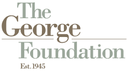

The George Foundation se enorgullece de ser el catalizador fundador de Fort Bend LINC, una iniciativa innovadora impulsada por la comunidad, diseñada para facilitar el acceso a la asistencia con el alquiler, la hipoteca y los servicios públicos para los residentes del condado de Fort Bend. Reconociendo que la estabilidad de la vivienda es fundamental para la resiliencia económica, la Fundación lanzó esta iniciativa en colaboración con Connective y una coalición de organizaciones sin fines de lucro, religiosas y del sector público.

Mediante un proceso de diseño centrado en el ser humano, The George Foundation lideró las primeras iniciativas para identificar las deficiencias en el sistema de apoyo existente, dar voz a las personas más afectadas y cocrear una solución coordinada y centrada en el cliente. Estos esfuerzos han dado como resultado el desarrollo de un nuevo plan de estabilidad habitacional y la creación de una plataforma centralizada que simplifica las solicitudes, aumenta la eficiencia y conecta a los residentes con recursos esenciales con dignidad y rapidez.

A través de LINC, imaginamos un futuro donde todos los residentes de Fort Bend, especialmente los inquilinos, puedan acceder más fácilmente a la ayuda que necesitan, evitar el desalojo y permanecer en una vivienda estable.

***Fort Bend LINC actualmente está compuesto por varias organizaciones sin fines de lucro de Fort Bend que trabajan juntos para brindar asistencia financiera y de otro tipo a las familias de Fort Bend.***

  

    
  

  

    
  

  

    
  

  

    
  

  

    
  

